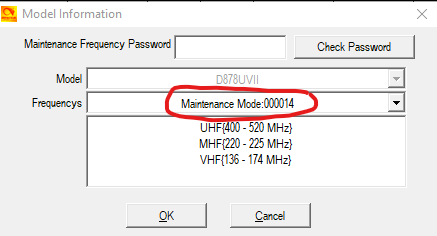

# Anytone AT-D878UVII Plus Codeplug

> [!WARNING]
> Codeplug version, CPS programming software version and firmware version installed in the radio must all be from the same version.
>
> You must [REBUILD](#rebuild) your codeplug every time a new CPS or firmware version is installed.

## Table of Contents
 - [Background](#background)
 - [Features](#features)
 - [Usage](#usage)
 - [Rebuild](#rebuild)
 - [Acknowledgements](#acknowledgements)

## Background
This codeplug was started as a personal project, then added entries for the George County ARES group when they got their DMR repeater back on the air. Now the focus has been shifted to make something for the State of Mississippi ARES team. Our goal would be to add all Mississippi Counties to the codeplug.

Unofficial Mississippi Amateur Radio Emergency Services (ARES) codeplug for the Anytone AT-D878UVII Plus radio.

This codeplug is a work in progress, please reach out to me if you notice any inaccuracies or would like to add repeaters in your Mississippi County.

Mississippi ARES EC's please reach out to me and let me know how you would like your county's zone configured. This should reflect the VHF/UHF information in your ICS-205.

## Features
 - 1295 Channels
 - 1165 Talk Groups
 - 64 Zones (so far)

Most English language BrandMeister talk groups are included, I have just started adding talk groups from TGIF and FreeDMR networks.

 - George County zone included
 - Stone County zone is included
 - Forest County zone is in the works
 - Lamar County zone is also in the works

Did I mention that this is primarily a codeplug for the amateur's located in the state of Mississippi?

The simplex frequencies channelized in this codeplug are as listed in the [SERA](https://sera.org/) Frequency Utilization Plans, as the frequency coordination in Mississippi is provided by them. (Could they make their website any less user friendly?) The exception(s) to this is where specific requests by specific Emergency Coordinator's were made.

## Usage
This repository hosts the codeplug for the AnyTone AT-D878UVII Plus radio. The codeplug is for:

 - CPS Version: 3.03 (Released 12/18/2023)
 - Firmware Version: 3.03

You must also be running in Mode 14 (Maintenance Mode):

Model --> Model Information

If your radio is not configured for Mode 14, this codeplug file cannot be installed onto your radio. We do provide all of the exported .CSV files so that you may easily import them directly into your codeplug and achieve the same results. You will also probably want to find the MURS (5 channels) and 220MHz channels (about 20) and remove them from the .csv file before importing them.

If there is enough interest, I may start another project to support Mode 7 (US Amateur Radio mode).

Using your favorite text editor or spreadsheet software, search for the hotspot frequency of **438.8000** and replace it with the frequncy that you used in your hotspot. You will need to search and replace the entries in both the *channels.csv* and *zones.csv* files.

## Rebuild
Virtually all problems with the AnyTone radios are caused by residual data in a codeplug file. Rebuilding your codeplug with fresh data will help with many problems and eliminate your radio from experiencing lockups or freezing.

Do not take any shortcuts with this process. It does require a little bit of effort on your part.

 1. Make sure your CPS software version matches the firmware version currently installed in your radio.
 2. Using your CPS software, open your existing codeplug and export everything (Tool --> Export --> Export All)
 3. Use the Windows Snipping tool to record every screen in your Optional Settings or write them down. If you are using encryption, you will need to record all your encryption keys. These settings and encryption keys are not saved by the Export All process.
 4. RESET the radio. This step is very important. If you do not do this, the old and possibly problematic data in the radio will not be removed.
 5. Using your CPS software, read from the freshly reset radio. 
 6. Import everything that you saved from Step 1.
 7. Complete your codeplug by reviewing your Optional Settings and encryption keys if applicable and confirm all is correct. Now is also a good time to update your DMR ID contacts list.
 8. Send the fresly rebuilt codeplug to the radio.
 9. If you had a custome startup picture or background pictures, send those to the radio.
 10. Save the new codeplug file. You should use this new save as the baseline for any future changes you may wish to make. You should also delete your old codeplug file.
 11. Use these steps to rebuild your codeplug EVERY time you upgrade your radio's firmware.

## Acknowledgements
Thanks to [KC5DJR](https://docs.google.com/spreadsheets/d/1748U_gqH5I_LlhYrRuc8aT72tSeO-dq3/edit?rtpof=true&sd=true#gid=1402313308) for his exhaustive work in documenting the BrandMeister talk groups. He has [his own codeplugs](https://www.qsl.net/kc5djr/DMR%20Super%20USA%20Codeplug.html) too. If you don't like this one, you may like his.
